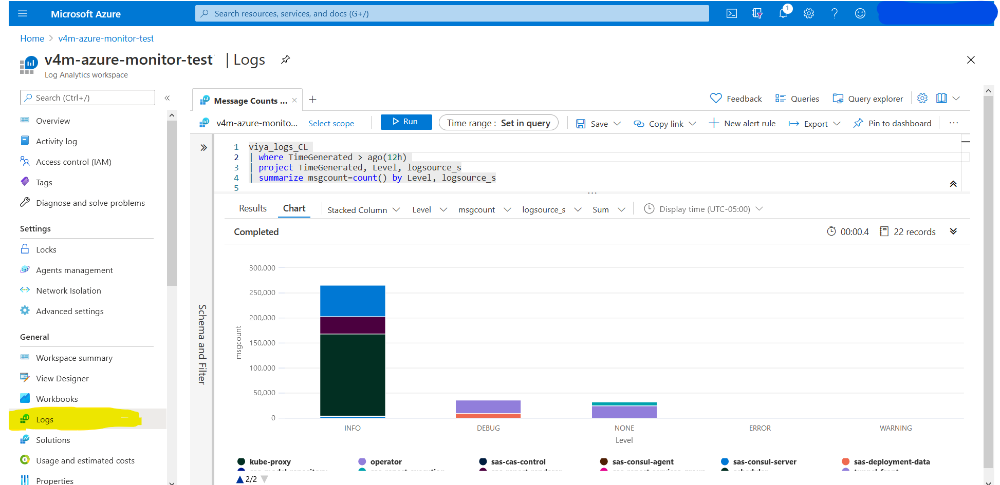

# Viewing Log Messages Using Fluent Bit and Azure Log Analytics

## Introduction

If you use Microsoft Azure and want to use Azure Monitor *instead* of Elasticsearch 
to explore, filter, and report on log messages from a SAS Viya environment, you 
can deploy the logging solution described in this document. This solution uses a 
combination of Fluent Bit and an Azure Log Analytics workspace to handle log 
messages so that they can be accessed by Azure Monitor. Please note that 
the development work in this solution has been limited, and is primarily a 
proof of concept.

**Note: Azure Monitor and Azure Log Analytics are optional features of 
Microsoft Azure, and they require agreement to additional licensing terms and 
additional charges. You must understand the terms and charges before you 
deploy the solution described in this document.**

## Technical Overview

In this solution, log messages are collected by the Fluent Bit
pods that are part of the standard logging solution and that are deployed 
cluster-wide by using a Kubernetes DaemonSet. These Fluent Bit pods can 
parse and process log messages from all SAS Viya components, including 
third-party products. As a result, log messages are handled consistently, 
regardless of the original source. 

In the standard solution, Fluent Bit sends the log messages to Elasticsearch. 
In this solution, the log messages are loaded into a Log Analytics workspace 
as a "custom log" source. You can then use Azure Monitor to explore, filter, and 
report on the collected log messages. By default, this solution also includes 
the Event Router, with is a component that surfaces Kubernetes events as 
pseudo-log messages beside the log messages collected by Fluent Bit.

## Deploy the Fluent Bit and Azure Log Analytics Solution

Follow these steps to deploy this solution:

1. Create a Log Analytics workspace. See the [Microsoft Azure documentation](https://docs.microsoft.com/en-us/azure/azure-monitor/learn/quick-create-workspace) for information.

2. Obtain the `CustomerId` for the workspace. You can obtain this information either from the Azure Portal or the Azure CLI.

Use this command to obtain the `CustomerId`. Replace the values of `myresourcegroup` and `myworkspace` with the values for your workspace. Note that you might access the Azure CLI using a different name or alias in your environment.

```
az monitor log-analytics workspace show --resource-group <myresourcegroup> --workspace-name <myworkspace> --query customerId
```
3. Obtain the `primarySharedKey` for the workspace. You can obtain this information either from the Azure Portal or the Azure CLI.

Use this command to obtain the `primarySharedKey`. Replace the values of `myresourcegroup` and `myworkspace` with the values for your workspace. Note that you might access the Azure CLI using a different name or alias in your environment.

```
 az monitor log-analytics workspace get-shared-keys --resource-group <myresourcegroup> --workspace-name <myworkspace>
```

This command returns two shared keys, labeled ***"primarySharedKey"*** and ***"secondarySharedKey"***. You only need to use the ***"primarySharedKey"***.

4. Set up your `USER_DIR` directory for an Azure deployment and export a `USER_DIR` environment variable that points to this location. See [/samples/azure-deployment/README.md](../samples/azure-deployment/README.md) for information.

5. Modify the file `$USER_DIR\logging\user.env`.

  - Specify the value you obtained for `CustomerId` for the `AZMONITOR_CUSTOMER_ID` environment variable.

    ```bash
    AZMONITOR_CUSTOMER_ID=<CustomerId>
    ```
  - Specify the value you obtained for `primarySharedKey` for the `AZMONITOR_SHARED_KEY` environment varaible.

    ```bash
    AZMONITOR_SHARED_KEY=<primarySharedKey>
    ```
6. Run this command to deploy this logging solution:

```bash
/logging/bin/deploy_logging_azmonitor.sh
```
## Remove the Fluent Bit and Azure Log Analytics Solution

To remove this solution, run this command:
```bash
/logging/bin/remove_logging_azmonitor.sh
```
By default, this script does NOT delete the namespace.

## Using Connection Information From Kubernetes Secret

The deployment script creates a Kubernetes secret named `connection-info-azmonitor`containing the connection information. 
This ensures that the connection information is available in case the Fluent Bit pods are
restarted or new nodes are added to the cluster. This secret is created
in the same namespace into which the Fluent Bit pods are deployed.  If this secret already exists
when you run the deployment script, the script obtains the connection information from the secret and you do not need to specify  the environment variables in the `user.env` file.

## Table and Variable Naming

After deploying this solution, the collected log messages appear as
a new table, **viya_logs_CL**, in the ***Custom Logs*** grouping within the
specified Log Analytics workspace.  The structure of this table is similar
to the structure of the log messages that are surfaced in Kibana when using the 
standard logging solution. However, due to features of the Azure
API, the names of some fields are slightly different. The tables feature
a flattened data model, so multi-level JSON fields appear as multiple
fields with the JSON hierarchy embedded in each field's name.  In addition, a 
suffix is added to the name of most of the fields to indicate the field's data type,
such as ***_s*** for string fields and ***_d*** for a numeric (double) field.

As an example, Fluent Bit adds Kubernetes metadata to each message, including
the namespace and name of the pod from which the message was collected.  This
information is contained nested in two fields, `namespace` and `pod`, under a top-level field
called `kube`, which creates the fields `kube.namespace` and `kube.pod`.  These fields
appear in the **viya_logs_CL** table as **kube_namespace_s** and **kube_pod_s**.

## Using the Data

Although a full explanation of how you can use the collected log messages in 
Azure Monitor and the Log Analytics workspace is out of scope for this document, 
here are some tips to help you get started.

###  Kusto Queries
Kusto is a powerful query language used by Log Analytics workspaces
and Azure Monitor. To access an interactive Kusto query window in Azure Monitor, 
select your Log Analytics workspace in Azure Monitor, then select **Logs** from 
the **General** area of the toolbar on the left side of the window. 



The query window enables you perform these actions:
  - Enter Kusto queries.
  - Display query results as charts or graphs.
  - Export the query results.
  - Add query results to an Azure dashboard. 

You can also use Kusto queries as part of Azure Monitor workbooks.

See the [Microsoft Kusto documentation](https://docs.microsoft.com/en-us/azure/data-explorer/kusto/concepts) for information.

Here are some sample Kusto queries.

### Sample Query #1: Show Log Messages Collected in the Past Five Minutes
This Kusto query returns all of the log messages collected in the past
five minutes.
```
viya_logs_CL 
| where TimeGenerated > ago(5m)
```
If a query returns a large number of results, only the first
10,000 results are shown. A message is displayed if the number of results is limited.

### Sample Query #2: Display Selected Fields
This Kusto query also returns the log messages collected in the past five minutes, but it 
returns only specific fields. Limiting the information returned might make it easier 
to interpret the results.
```
viya_logs_CL
| where TimeGenerated > ago(5m)
| project TimeGenerated, Level, logsource_s, Message
```
### Sample Query #3: Display Message Counts by Message Severity and Source
The following query also returns the number of log messages generated over the last
five minutes, but also summarizes the messages by message severity (**Level**) and source (**logsource_s**).
The query returns the results in the form of a table. To view the results as 
a chart, click **Chart** item in the menu above the results output.  
```
viya_logs_CL
| where TimeGenerated > ago(5m)
| project TimeGenerated, Level, logsource_s
| summarize msgcount=count() by Level, logsource_s
```
Note that this query and the results in chart form are shown in the screenshot above.
