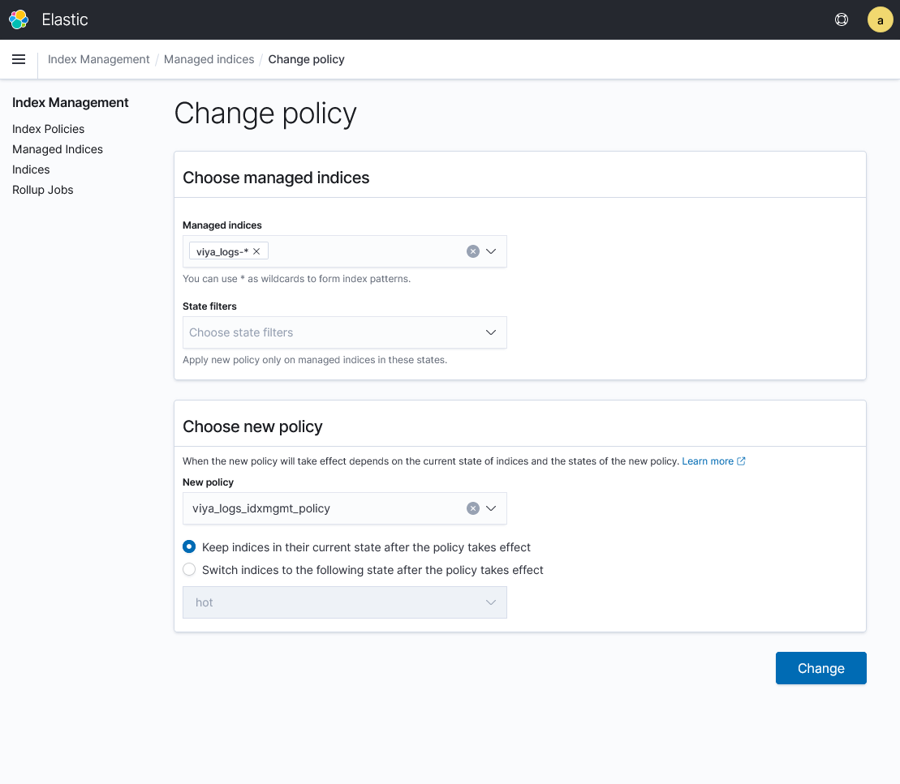

# Log Message Retention

## About Log Message Retention

### Default Retention Periods

Log messages are retained for a set amount of time. These are the default 
log-retention periods:

* Messages from SAS Viya and from other Kubernetes pods on the cluster are 
  retained for ***three*** days.
* Messages from logging components are retained for ***one*** day.

### Index Policies and the Index State Management Plug-In

Log-retention processing is implemented via index policies. These are a feature 
of the Index State Management plug-in to OpenSearch. The 
two index management policies defined are identical other than the retention 
period.  For each policy, an incoming message is loaded into memory and placed 
in the "hot" state, which makes it available to be searched. After the retention 
period has passed, the message moves to the "doomed" state and is deleted from 
memory and the back-end data store. Once deleted, the message is no longer 
available and cannot be included in search results.

These actions and retention periods are defined by the following index management 
policies:
 
* SAS Viya and Kubernetes pods: 
  * Policy name: viya_logs_idxmgmt_policy
  * Default retention period: 3 days 
  * To change the retention period for these messages prior to the initial 
  deployment of the log-monitoring components, modify the `LOG_RETENTION_PERIOD` 
  environment variable.  To change the retention period after initial deployment, see [Adjusting the Retention Policy](#Adjusting-the-Retention-Policy). 

* Internal monitoring components (that is, Grafana, OpenSearch, and so on):
  * Policy name: viya_ops_idxmgmt_policy
  * Default retention period: 1 day 
  * To change the retention period for these messages prior to the initial deployment 
  of the log-monitoring components, modify the `OPS_LOG_RETENTION_PERIOD` environment 
  variable. To change the retention period after initial deployment, see 
  [Adjusting the Retention Policy](#Adjusting-the-Retention-Policy). 

 If you are deploying on OpenShift, a third policy is added to manage log messages 
 from OpenShift infrastructure namespaces. These namespaces start with "openshift". 
 
* Policy name: viya_infra_idxmgmt_policy
* Default retention period: 1 day
* To change the retention period for OpenShift infrastructure 
 messages prior to the initial deployment of the log-monitoring components, 
 modify the `INFRA_LOG_RETENTION_PERIOD` environment variable.  To change the retention period after initial 
 deployment, see [Adjusting the Retention Policy](#Adjusting-the-Retention-Policy).

You can modify these policies or create your own. For information about index 
management, see [Index State Management](https://opensearch.org/docs/1.3/im-plugin/ism/index) 
in the OpenSearch documentation.

>**IMPORTANT**: It is important to remember that SAS® Viya® Monitoring for 
Kubernetes is focused on operational monitoring. That is, helping administrators 
in their day-to-day work to ensure that SAS Viya is meeting their users' needs. This 
is especially true with regard to the log monitoring.  Log messages are 
collected and stored for day-to-day operational purposes with all of the 
collected log messages made equally available.  The solution is not designed 
to provide long-term storage or archival of log messages.  The log-retention 
period should be thought of in terms of days rather than weeks or months. The 
underlying OpenSearch technology can be configured to 
support longer time frames. However, doing so would involve developing more 
complex index management policies and storage configurations.  Refer to the 
OpenSearch documentation for more information.

## Increasing Storage

### About Retention and Storage

 Although you can modify the length of time that log messages are retained, it 
 is important to understand that doing so can impact the amount of storage 
 needed for OpenSearch.  

 Unless you are reducing the retention period or increasing it by only a day 
 or two, you must increase the size of the persistent volume claims (PVCs) 
 associated with the OpenSearch pods. 

### Identifying Current Storage Use

There is no simple formula to calculate how a change in the retention period 
can impact the required storage.  However, you can determine how much space 
currently is being consumed by the OpenSearch indexes (the storage structures 
used by OpenSearch). Using that information, you can estimate a size increase.  
 
To see the amount of storage consumed by each OpenSearch index, complete the 
following steps in OpenSearch Dashboards:

1. From the main menu, navigate to the **Index Management** window.
2. Select **Indices** from the menu on the left side.
   A list of all of the indexes currently stored in OpenSearch is displayed. The list might be multiple pages.  
3. Adjust the number of indexes shown per page by using the control at the 
bottom of the table. 
4. In the **Search** field above the list of indexes, enter the filter criteria 
to view all of the indexes that were created for one day. For example, enter 
*2022\*01\*10* to view indexes created on January 10, 2022.
5. For each index, the **Total Size** column shows the amount of storage 
consumed by the index. Add the values in the **Total Size** columns for 
one day. The sum is the storage required for that day's worth of log messages.
 
**Note:** The volume of log messages varies day-by-day based on use. Calculate 
the amount of storage consumed for a few days before making any assumptions.  

### Example Estimate

  **Important:** This example and its sums are relevant only for the example 
  cluster. The sums for your cluster can be different and potentially 
  significantly different.  

The "Indices" window shows the indexes for a single day (January 24, 2022) on a cluster. 

 
The filter criteria (2022\*01\*24) limits the list to that day. The sum of 
the **Total Size** columns shows that about 28 GB of log messages were 
collected on that day. Performing the same exercise for other days shows 
comparable sums. To store 5 days of logs, you need at least 140 GB (5 days 
x 28 GB per day) of storage. Then, increasing the estimate by 50 or 100 
percent is not unreasonable. The extra margin can allow for logging due 
to increased user activity or problems.
 
The current default configuration creates three OpenSearch nodes 
(that is, the pods responsible for storing the OpenSearch indexes) and 
configures a 30 GB PVC for each node.  This means there is a maximum of 
90 GB of storage available.  The default configuration also sets the 
log-retention period to 3 days.  Although this default configuration 
might work for the sample cluster, it will not work when expanding the 
log-retention period to 5 days.  And, even if the current retention 
period is unchanged, there is no extra margin. Any increase in logging 
levels might fill up the available space.  

### Consequences of Failing to Increase Storage

When all available space has been consumed, the OpenSearch cluster fails:

* No new log messages are stored. 
* The housekeeping process that purges old log messages does not run.
* The cluster becomes unusable.

### Increasing the Storage for the OpenSearch Nodes

Use the following information to increase the storage for the existing 
OpenSearch nodes.

#### Verify Support for Expansion

Some Kubernetes storageClass resources do not support expansion. To 
determine whether the storageClass resources used by the OpenSearch data node 
PVCs support expansion, enter the following command: 

`kubectl describe storageClass default` 

* Where ***storageClass*** is the name of your specific storageClass.
* Where ***default*** is the name of the storageClass that is used for the PVCs 
that you are checking.  
  
Review the command output. If the `AllowVolumeExpansion` property is `True`, the 
expansion of existing PVCs is supported and the following procedure should work.

#### Increase the Storage

To increase storage, complete the following steps:

1. Scale down the statefulSet that controls the OpenSearch nodes by 
entering the following command:
   
    `kubectl -n logging scale statefulset v4m-search --replicas=0`

   * Where ***logging*** is the namespace into which the log-monitoring 
   components have been deployed in your installation.
   * This command terminates the existing "v4m-search-*" pods.
   * In some cases, it might be necessary to wait a few minutes until the 
   PVCs are detached from the underlying Kubernetes nodes.  Be patient. 
   Resizing the PVC fails if the PVCs are still attached.

2. Resize the existing PVCs by entering the following command (all on one line):
   
   `kubectl -n logging patch pvc data_node -p '{"spec":{"resources":{"requests":{"storage":"nnGi"}}}}'`
   * Where ***logging*** is the namespace into which the log-monitoring 
   components have been deployed in your installation.
   * Where ***data_node*** is the OpenSearch node (pod) to resize 
   (for example, `v4m-search-v4m-search-0`).
   * Where ***nnGi*** is the amount (for example, 70Gi) to increase the PVC 
   storage.
   * Repeat this command for each of the three OpenSearch nodes (that 
   is, `v4m-search-v4m-search-0`, `v4m-search-v4m-search-1`, and `v4m-search-v4m-search-2`).

3. Scale up the statefulSet that controls the OpenSearch nodes by 
entering the following command:
  
    `kubectl -n logging scale statefulset v4m-search --replicas=3`
   * Where ***logging*** is the namespace into which the log-monitoring 
   components have been deployed in your installation.
   * This command results in the creation of three new "v4m-search-*" pods that 
   are linked to the existing (but now larger) PVCs.

If you are maintaining customized configuration information (that is, using the 
USER_DIR functionality), consider updating the contents of the 
`logging/user-values-opensearch.yaml` file to reflect the larger PVC size. Doing 
so ensures that your updated configuration is re-created if you redeploy 
the log-monitoring components. For information about the USER_DIR feature, see 
[Customize the Deployment](README.md#customize-the-deployment) in the README 
for Logging.

**Note:** This procedure adjusts only the size of the existing PVCs and does not 
change the PVC specification included in the statefulSet definition.  If you 
scale up the statefulSet to increase the number of OpenSearch nodes beyond 
the existing three pods, the new pods are linked to PVCs using the original 
size. At that point, you must repeat this procedure to increase the size of the 
PVCs linked to the new pod.

## Adjusting the Retention Policy

### About Policy Updates

When you edit a policy, the change is **not** applied retroactively to the 
indexes that already exist. 

* Newly created indexes use the updated retention policy. 
* Existing indexes continue to be retained for 3 days.  
 
If you want the updated policy to apply to existing indexes, you must apply the 
updated policy to those existing indexes as well.

### Considerations

If you are maintaining customized configuration information (that is, using the 
USER_DIR functionality), consider updating the contents of the `logging/user.env` 
file to reflect the modified retention periods. Doing so ensures that your 
updated configuration is re-created if you redeploy the log-monitoring components.

### Edit the Policy

To review and edit the index management policies in OpenSearch Dashboards, complete the following 
steps:
 
 1. Select **Index Management** from the main menu (that is, the menu that includes 
 **Discover** and  **Dashboard**).
 2. Select the policy that you want to edit.
 3. Click **Edit**. The "Edit policy" window appears. 
 
 4. In the **Define policy** pane, locate the **min_index_age** value. 
 5. Change the existing value of "3d" to the new value.
 6. Click **Update**. The updated policy is used for any newly created indexes.

### Apply an Updated Policy to an Existing Index

When you edit a policy, the change is **not** applied retroactively to the 
indexes that already exist. To apply an updated policy to an existing index, 
complete the following steps:

1. Select **Index Management** from the main menu (that is, the menu that 
includes **Discover** and  **Dashboard**).
2. Select **Managed Indices** from the subsequent main menu.
3. Click **Change Policy**. It is located in the upper-right area of the 
window. The "Change policy" window appears. 
    
1. In the **Managed indices** list box, enter: *`viya_logs-`* 
   
   **Tip:** The interface might suggest **viya_logs-\***. Accept the suggestion 
   by pressing the **Enter** key.

2. Select **viya_logs_idxmgmt_policy** from the **New policy** list box.
3. Make sure the **Keep indices in their current state after the policy takes effect** 
option is selected.
7. Click **Change**.

    * A message appears that indicates how many indexes were updated.
    * The back-end processing for handling log roll-off runs periodically. The 
    changes might take a couple of hours to take effect and be reflected in OpenSearch Dashboards.

## Important Considerations

OpenSearch performance tuning is very complicated. It is 
very dependent on unique use patterns and activity. To ensure the best performance 
in your specific environment, you might need to make other configuration changes 
after changing the log-retention period. Such changes can include adjusting one 
or more of the following:

* the Java memory settings of the OpenSearch nodes
* the number of OpenSearch nodes 
* the specific mix of OpenSearch node types
