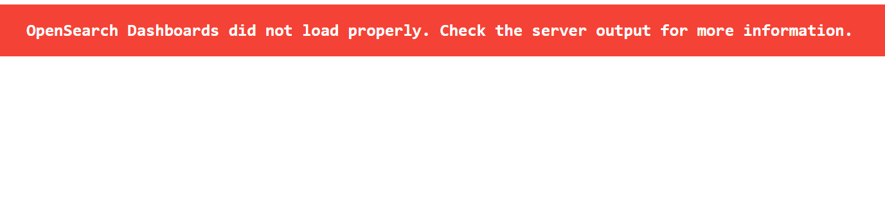

# Contour

## Overview

This sample demonstrates how to configure [Contour](https://projectcontour.io/) HTTPProxy resources for accessing the
web applications that are deployed as part of the SAS Viya Monitoring for Kubernetes solution.

This sample provides information about two scenarios:

* host-based routing
* path-based routing

These scenarios differ in how the URL used to access the applications is constructed:

* In host-based routing, the application name is part of the host name itself (for example, `https://grafana.host.cluster.example.com/`).
* In path-based routing, the host name is fixed and the application name is appended as a path on the URL (for example, `https://host.cluster.example.com/grafana`).

## Using This Sample

**Note:** For information about the customization process, see
[Create the Deployment Directory](https://documentation.sas.com/?cdcId=obsrvcdc&cdcVersion=v_003&docsetId=obsrvdply&docsetTarget=p15fe8611w9njkn1fucwbvlz8tyg.htm) in the SAS Viya Monitoring for Kubernetes Help Center.

The customization files in this sample provide a starting point for the
customization files required by a deployment that uses Contour HTTPProxy
resources for accessing the web applications.

To use the sample customization files in your
deployment, complete these steps:

1. Copy the customization files from either the `host-based`
or `path-based` subdirectories to your local customization directory
(that is, your `USER_DIR`).
2. In the configuration files, replace all instances of
   `host.cluster.example.com` with the applicable host name for your
   environment.
3. (Optional) Modify the files further, as needed.
4. Create the Kubernetes Secret resource(s) containing the ingress
TLS certificates referenced in the  HTTPProxy resource definition
files you modified above.  In the sample files, this Secret is
named `v4m-ingress-tls-secret`.
5. After you finish modifying the customization files, you deploy
SAS Viya Monitoring for Kubernetes.  For more information, see
[Deploy](https://documentation.sas.com/?cdcId=obsrvcdc&cdcVersion=v_003&docsetId=obsrvdply&docsetTarget=n1rhzwx0mcnnnun17q11v85bspyk.htm).
6. Once the deployment process completes, you create the required HTTPProxy resources
by using the `kubectl apply` command and pointing to appropriate YAML file(s).

NOTE: At some sites, the ability to create HTTPProxy resources and/or how they can be configured, may be restricted.
Those restrictions could require additional modifications to make this sample work or require an entirely different approach.

## Update the YAML Files

Edit the .yaml files you copied into your `$USER_DIR/logging` and `$USER_DIR/monitoring`
subdirectories. Replace any sample host names with the applicable host name
for your deployment. Specifically, you must replace `host.cluster.example.com` with
the appropriate host name.

## Specify TLS Certificates to Use

This sample assumes that access to the web applications should be secured using
TLS (that is, the web applications should be accessed via HTTPS instead of HTTP).
**This requires a set of TLS certificates that are _not_ created automatically for you.**
You must obtain these certificates, create Kubernetes secrets with specific names, and make
them available to SAS Viya Monitoring for Kubernetes.
For details, see [Enable TLS for Ingress](https://documentation.sas.com/?cdcId=obsrvcdc&cdcVersion=v_003&docsetId=obsrvdply&docsetTarget=n0auhd4hutsf7xn169hfvriysz4e.htm#n13g4ybmjfxr2an1tuy6a20zpvw7).

This sample shows a single set of TLS certificates (stored in the Kubernetes Secret
`v4m-ingress-tls-secret`) used to secure all of the HTTPProxy resources.  However,
that is not required.  You can use different TLS certificates for one (or more) of the
HTTPProxy resources; just update the `spec.virtualhost.tls.secretname` key in the
appropriate YAML file before creating the HTTPProxy resources.

## Create the HTTPProxy Resources
After running the deployment script, you need to create additional Kubernetes resources for
Grafana and/or OpenSearch Dashboards.  To create these required HTTPProxy resources, you
run the `kubectl apply` command and pointing to the appropriate YAML file(s).  The HTTPProxy
resource definitions are contained in files with names ending in `_httpproxy.yaml`
which you copied into your `$USER_DIR/logging` and `$USER_DIR/monitoring` subdirectories.

For example, the following command would create the HTTPProxy resource needed to access
Grafana via the host-based configuration:
` kubectl -n monitoring apply -f $USER_DIR/monitoring/grafana_httpproxy.yaml`

In both the host-based and path-based scenarios, a separate HTTPProxy resource is created
for each web application you make available. In the path-based scenario, an additional
HTTPProxy resource, referred to as the "root proxy", will be needed as well.  An
additional yaml file, named `root_httpproxy.yaml`, defining this resource is provided and
the same `kubectl apply` command is used to create the resource.  Furthermore, note that
in the path-based configuration, this example adds a prefix (matching the namespace)
to the hostname used in FQDN specified.  While this is not strictly necessary, including
this prefix allows the HTTPProxy resources to be independent of any other "root proxy"
(i.e. other HTTPProxy resources referencing the same virtualhost) resources.  If you omit
the prefix, you will likely need to incorporate the routes for these web applications
into existing HTTPProxy resources deployed in your environment rather than deploying new
HTTPProxy resources.

### Making secondary applications accessible
**This sample does NOT recommend making Prometheus and Alertmanager accessible
by default.  The Prometheus and Alertmanager applications do not include any
native authentication mechanism by default, and exposing such an application
without other restrictions in place is insecure.   In addition, this sample
does NOT recommend making the OpenSearch API endpoint accessible by default.  Although the
OpenSearch API endpoint does require authentication, there are limited
use-cases requiring it to be accessible.**

However, this sample includes file enabling you to make one or more of these web
applications accessible if needed.  To do so, create the necessary HTTPProxy resources
by using the  same `kubectl apply` command describe above and pointing to the appropriate
YAML file.  In addition, for the path-based scenario, you will need to uncomment
the appropriate lines in the `root_httpproxy.yaml` files as described in comments
within those files.


## Confirm the Status of the HTTPProxy Resources

Once you have deployed the HTTPProxy resources, you should check their status.
This can be done using `kubectl get HTTPProxy` and `kubectl describe HTTPProxy`
commands.  The output of the `kubectl get` command will report whether the
HTTPProxy resource configuration is valid or not.  If the configuration is not
valid, running the `kubectl describe` command will return additional information
which may help clarify how to resolve the issues.

In the following sample console excerpt, we see that there is some sort of issue
with the `v4m-osd` HTTPProxy.  And, after running the `kubectl describe` command
on the invalid HTTPProxy resource, we see that the problem is caused by a missing
Kubernetes Secret resource.  After creating the missing secret (not shown),
re-running the `kubectl get` command shows the HTTPProxy resource is now in a
valid state.

```
$ kubectl -n logging get HTTPProxy
NAME         FQDN                              TLS SECRET               STATUS    STATUS DESCRIPTION
v4m-osd      dashboards.************.sas.com   v4m-ingress-tls-secret   invalid   At least one error present, see Errors for details

$ kubectl -n logging describe HTTPProxy v4m-osd
Name:         v4m-osd
Namespace:    logging
Labels:       <none>
Annotations:  <none>
API Version:  projectcontour.io/v1
Kind:         HTTPProxy
Metadata:
  Creation Timestamp:  2026-01-21T23:00:25Z
  Generation:          1
  Resource Version:    247774
  UID:                 4f78e921-1b3d-4946-92cd-d6bc34440059
Spec:
  Routes:
    Conditions:
      Prefix:  /
    Services:
      Name:      v4m-osd
      Port:      5601
      Protocol:  tls
  Virtualhost:
    Fqdn:  dashboards.************.sas.com
    Tls:
      Secret Name:  v4m-ingress-tls-secret
Status:
  Conditions:
    Errors:
      Message:             Spec.VirtualHost.TLS Secret "v4m-ingress-tls-secret" is invalid: Secret not found
      Reason:              SecretNotValid
      Status:              True
      Type:                TLSError
    Last Transition Time:  2026-01-21T23:00:25Z
    Message:               At least one error present, see Errors for details
    Observed Generation:   1
    Reason:                ErrorPresent
    Status:                False
    Type:                  Valid
  Current Status:          invalid
  Description:             At least one error present, see Errors for details
  Load Balancer:
    Ingress:
      Ip:       **.**.**.**
      Ip Mode:  VIP
Events:         <none>

$ kubectl -n logging get HTTPProxy
NAME         FQDN                              TLS SECRET               STATUS   STATUS DESCRIPTION
v4m-osd      dashboards.************.sas.com   v4m-ingress-tls-secret   valid    Valid HTTPProxy
```


## Access the Applications

### When Using the Host-Based Configuration

**Note:** Be sure to replace the placeholder host names with the host names that you specified in your environment.

When you deploy using the host-based configuration, the following applications are available at these locations:

* Grafana - `https://grafana.host.mycluster.example.com`
* OpenSearch Dashboards - `https://dashboards.host.mycluster.example.com`

If you have chosen to make the following applications available and you have used the host-based
configuration, the applications are available at these locations:

* Prometheus - `https://prometheus.host.mycluster.example.com`
* Alertmanager - `https://alertmanager.host.mycluster.example.com`
* OpenSearch - `https://search.host.mycluster.example.com`

### When Using the Path-Based Configuration

**Note:** Be sure to replace the placeholder host names with the host names that you specified in your environment.

When you deploy using the path-based configuragtion, the following applications are available at these locations.

* Grafana - `https://logging.host.mycluster.example.com/grafana`
* OpenSearch Dashboards - `https://logging.host.mycluster.example.com/dashboards`

If you have chosen to make the following applications available and you have used the path-based configuration,
the applications are available at these locations:

* Prometheus - `https://monitoring.host.mycluster.example.com/prometheus`
* Alertmanager - `https://monitoring.host.mycluster.example.com/alertmanager`
* OpenSearch - `https://monitoring.host.mycluster.example.com/opensearch`

## Known Issues
### OpenSearch Dashboards Did Not Load Properly
We often see a banner (as shown below) indicating that OpenSearch Dashboards did not load properly
when OpenSearch Dashboards is first brought up in a web browser after deploying the HTTPProxy resources.
However, we have consistently seen the issue resolve itself after a simple refresh (F5) of the browser window.


