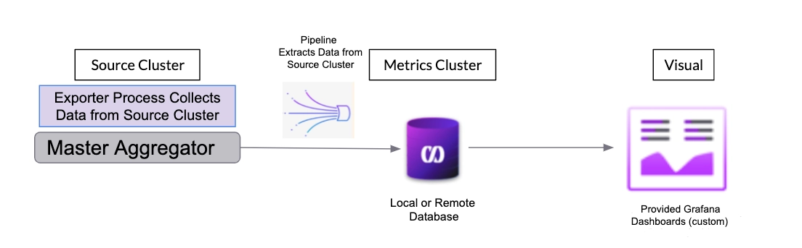
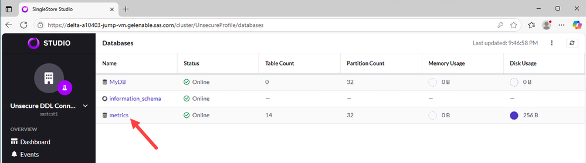

# Monitoring SAS SpeedyStore (SingleStore)
## Overview
This sample demonstrates how to extend SAS Viya Monitoring for Kubernetes to monitor the SingleStore instance embedded within SAS SpeedyStore.  This allows administrators to monitor their SingleStore cluster using the same Grafana instance they use to monitor the rest of their SAS Viya deployment.

This sample is primarily derived from the blog post [Using Grafana dashboards for monitoring SAS SpeedyStore](https://communities.sas.com/t5/SAS-Communities-Library/Using-Grafana-dashboards-for-monitoring-SAS-SpeedyStore/ta-p/973178) written by Michael Goddard from SAS Education.  The blog post was, in turn, based on work Michael did in preparing to cover the topic as part of the [SAS® SpeedyStore: Architect and Deploy the SAS® Viya® Platform with SingleStore](https://learn.sas.com/course/view.php?id=6393) workshop available in [learn.sas.com](https://learn.sas.com/).  This sample includes Grafana dashboards developed and made available by SingleStore.

**Note: This sample documents one possible approach, there might be other ways to achieve the same objectives.**

## Using this Sample
Enabling this monitoring will required configuring components in both SingleStore and Grafana.  While this sample describes how to configure the SingleStore components, you are strongly encouraged to review the official SingleStore documentation for a more comprehensive discussion of how to monitor SingleStore effectively, the options for doing so, and additional implementation details.  After configuring the SingleStore components, this sample covers defining the datasource within Grafana and deploying the SingleStore-specific Grafana dashboards.

The diagram below, taken from the [SingleStore documentation](https://docs.singlestore.com/db/v8.9/user-and-cluster-administration/cluster-health-and-performance/configure-monitoring/), provides a high-level overview of metric collection and reporting process.  As shown, the SingleStore pipeline extracts metrics from the SingleStore cluster and stores them within a metrics database.  Grafana pulls metric data directly from this metrics database to populate the dashboards administrators view.



### Overview of Process
* Prerequisites and Set-Up
* Configure SingleStore
  * Create the SingleStore pipeline and metrics database
  * Create the "S2MonitorUser" user
* Configure Grafana
  * Create the datasource
  * Import the SingleStore dashboards

### Prerequisites and Set-Up
#### Prerequisites
* SingleStore Toolbox

You will need to use the SingleStore Toolbox package to deploy, administer, and manage a SingleStore cluster. [Installation instructions for SingleStore Toolbox](https://docs.singlestore.com/db/v8.9/user-and-cluster-administration/cluster-management-with-tools/singlestore-tools-installation/singlestore-toolbox-installation/) are available on the SingleStore website.

* SingleStore CLI or SingleStore Studio

You will need to use submit database commands via the SingleStore CLI to create a database user and grant them the appropriate permissions.  [Installation instructions for SingleStore CLI](https://docs.singlestore.com/db/v8.9/user-and-cluster-administration/cluster-management-with-tools/singlestore-tools-installation/singlestore-client-installation/) are available on the SingleStore website.

Or, alternatively, you can submit the necessary commands via the SingleStore Studio SQL Editor panel.
* `kubectl`

You will need to use `kubectl` commands to obtain information about your SAS Viya and SingleStore deployments.

#### Set the VIYA_NS environent variable

Since you will need to refer repeatedly to the namespace in which SAS Viya (and SingleStore) is deployed, it is helpful to define an environment variable, `VIYA_NS`, to identify the namespace and reference it in subsequent commands.

In the following command, the `VIYA_NS` environment variable is defined and assigned the value identifying the namespace containing our SAS Viya deployment (i.e. ***myviya*** ):

 `VIYA_NS=myviya`

### Configure SingleStore
#### Create the SingleStore pipeline and metrics database
The `sdb-admin start-monitoring-kube` command is used to configure and start the monitoring. It has a number of flags to control its operations.  See the [SingleStore documentation](https://docs.singlestore.com/db/v8.9/reference/singlestore-tools-reference/sdb-admin-commands/start-monitoring-kube/) for more information.

Before submitting the `sdb-admin start-monitoring-kube` command, the various parameters being passed to the command and how to determine their proper values will be reviewed.

#### The `cluster-name` parameter
The default name for the SingleStore cluster in a SAS SpeedyStore deployment is: ***sas-singlestore-cluster***.  However, since it is possible to change this name, it is important to confirm the actual cluster name before configuring the monitoring.

To get the cluster name, submit the following command via the SingleStore CLI:

 `show global variables like 'cluster_name%';`

If the cluster name is different than the default, be sure to use the correct value in subsequent commands.

#### The `user` and `password` parameters
A core part of the monitoring is the exporter process which collects the metric data from the cluster. The exporter process is typically run as the SingleStore 'root' user due to the permissions required.

NOTE: It is possible to run the process as another user but the user must have the low level permissions needed to create and control the metrics database and pipelines.  Setting up an alternate user for this is out-of-scope for this sample and we will use the 'root' user.

You need the password for the SingleStore 'root' user.  You can use the following command to get the password for the 'root' user and store it in the `ROOT_PWD` environment variable:

`ROOT_PWD=$(kubectl -n ${VIYA_NS} get secret sas-singlestore-cluster -o yaml | grep "ROOT_PASSWORD"|awk '{print $2}'|base64 -d --wrap=0)`

#### The `exporter-host` parameter
As shown in the diagram above, the export process runs on the Master Aggregator. Therefore, you need to target the SingleStore Master node; i.e. the **node-sas-singlestore-cluster-master-0** node (pod) in a SAS SpeedyStore deployment.  In this example, that pod's IP address will be used for the `exporter-host` parameter.

You can obtain the IP address for the Master node and store it in the `CLUSTER_MASTER_IP` environment variable by submitting the following command:

`CLUSTER_MASTER_IP=$(kubectl -n ${VIYA_NS} get pods -o wide | grep 'node-sas-singlestore-cluster-master-0' | awk '{print $6}')`

#### Disabling interactive mode
By default, the `sdb-admin start-monitoring-kube` command displays some information and asks the user if they would like to continue.  To skip this prompt and have the configuration continue automatically, this example includes the `--yes` parameter.

#### Accessing the Kubernetess Cluster
The `sb-admin` command needs to access the Kubernetes cluster on which SAS Viya and SingleStore are running.  It does this through a Kubernetes configuration file.  By default, the command uses the file identified in the `KUBECONFIG` environment variable (if defined), or the `~/.kube/config` file (if it exists) to discover the cluster. Alternatively, the `--config-file` option can be used to specify the kube config file to use.

#### Run the `sb-admin start-monitoring-kube` command
After setting all of the required parameters, submit the following command to configure and start the monitoring, including the metrics database:

`sdb-admin start-monitoring-kube --cluster-name sas-singlestore-cluster --namespace $VIYA_NS --user root --password $ROOT_PWD --exporter-host $CLUSTER_MASTER_IP --yes`

After running the command, you should see output similar to the following:

```
✓ Successfully discovered resources
Toolbox will perform the following actions:
  · create a database metrics with tables and procedures for monitoring
  · set retention period to 7 days for 192.168.0.164:9104
  · set purge frequency to 60 minutes for 192.168.0.164:9104
  · set purge log retention period to 365 days

Would you like to continue? [Y/n]:
Automatically selected yes, non-interactive mode enabled

Operation completed successfully
```

Once completed, the exporter process, the pipeline, and the '**metrics**' database have been created. You can use the SingleStore Studio, to confirm this. For example, in the screenshot below, you can see the newly created `**metrics**' database:


### Create the "S2MonitorUser" user
Next, you need to create a specific user that Grafana can use to connect to the '**metrics**' database.  After logging into SingleStore with the admin user, you can submit the `CREATE USER` and `GRANT` commands via the SingleStore CLI (or, from the SQL Editor within SingleStore Studio) to create the user and grant the user the desired permissions.

For example, the following command creates a user called `S2MonitorUser` and sets its password:

`CREATE USER S2MonitorUser IDENTIFIED BY 'password123' REQUIRE NONE;`

The following command grants a minimal set of permissions that allows the newly created user to access the collected metrics and populate the Grafana dashboards:

`GRANT SELECT, SHOW VIEW, EXECUTE ON metrics.* TO 'S2MonitorUser'@'%'`

Alternatively, while the limited permissions above are sufficient to pull metrics from the database, it can be helpful to grant additional permissions so this same user can be used to manage the metrics database, pipelines, and the exporter process.

The following commands grant a broader set of permissions to allow the monitoring user to perform these administrator duties:

`GRANT CLUSTER, SHOW METADATA, SELECT, PROCESS ON *.* to 'S2MonitorUser'@'%';`

`GRANT SELECT, CREATE, INSERT, UPDATE, DELETE, EXECUTE, INDEX, ALTER, DROP, CREATE DATABASE, LOCK TABLES, CREATE VIEW, SHOW VIEW, CREATE ROUTINE, CREATE PIPELINE, DROP PIPELINE, ALTER PIPELINE, START PIPELINE, SHOW PIPELINE ON metrics.* to 'S2MonitorUser'@'%';`

You should consider your organization's specific needs before deciding whether to grant the more limited or the broader set of permissions to this user.
### Configure Grafana
#### Configure the Grafana Datasource
Grafana datasources provide connection information allowing Grafana to access metric information in response to user queries and to populate dashboards.

The file [speedystore-datasource.yaml](speedystore-datasource.yaml) in this directory defines the datasource that will allow Grafana to access the '**metrics**' database created above.  However, before it can be used, it needs to be edited to provide the proper credentials (i.e. the ***user*** and ***password*** fields in the file).  You also need to update the ***url*** field to reflect the namespace in which SAS Viya deployment is deployed.

For example, if SAS Viya is deployed into the ***myviya*** namespace, you would revise the ***url*** value from:

`svc-sas-singlestore-cluster-ddl.{**Replace with SAS VIYA Namespace**}.svc.cluster.local:3306`

to:

`url: svc-sas-singlestore-cluster-ddl.myviya.svc.cluster.local:3306`

 If the name of the SingleStore cluster is not ***sas-singlestore-cluster***, you need to update that portion of the  ***url*** field in the file as well.

Copy the file to some location, update the necessary information, and save your changes.  We suggest copying the file into your `$USER_DIR/monitoring` sub-directory, i.e. the same directory used for any other customizations related to the metric monitoring components you have made to your deployment of SAS Viya Monitoring.  This will ensure all of the files related to this deployment of SAS Viya Monitoring are in one place.

Then submit the following command to create the datasource:

`kubectl -n monitoring create secret generic grafana-speedystore-connection --from-file=$USER_DIR/monitoring/speedystore-datasource.yaml`

NOTE: This command assumes the metric monitoring components (including Grafana) have been deployed into the `monitoring` namespace.  If they are deployed in a different namespace, update the command to reference the correct namespace.

After the secret has been created, you need to apply a specific label to the secret to trigger the automatic provisioning (loading) of the datasource into Grafana.

You can use the following command to apply the necessary label:

`kubectl -n monitoring label secret grafana-speedystore-connection "grafana_datasource=1"`


#### Import the SingleStore Dashboards into Grafana
To import the SingleStore dashboards into Grafana, you can use the `deploy_dashboards.sh` script found in the `monitoring/bin` sub-directory of this repository.

You can use the following command to import all of the SingleStore dashboards:

`./monitoring/bin/deploy_dashboards.sh samples/speedystore/dashboards`

Or, you can import specific dashboards individually using the same script.  For example, following command imports the ***Cluster View*** dashboard into Grafana:

`./monitoring/bin/deploy_dashboards.sh samples/speedystore/dashboards/clusterview.yaml`

### Validate everything is working
Once the dashboards have been imported into Grafana, you should be all set to monitor the SingleStore instance embedded in SAS SpeedyStore.

To validate the configuration, sign into Grafana and review the SingleStore dashboards you've imported.  All of the imported dashboards have the ***"sas-speedystore"*** and ***"singlestore"*** tags.  While the data shown will vary based on user activity, all of the dashboards should be available with no errors or warning icons or messages.

## The Grafana Dashboards
This is a list of the SingleStore dashboards included in this sample.   Each dashboard name in the list is a link to more information about the dashboard in the SingleStore documentation including the metrics depicted and the types of questions they address.

* [Cluster View](https://docs.singlestore.com/db/v8.9/user-and-cluster-administration/cluster-health-and-performance/configure-monitoring/view-the-dashboards/#cluster-view)
* [Detailed Cluster View by Node](https://docs.singlestore.com/db/v8.9/user-and-cluster-administration/cluster-health-and-performance/configure-monitoring/view-the-dashboards/#detailed-cluster-view-by-node)
* [Disk Usage](https://docs.singlestore.com/db/v8.9/user-and-cluster-administration/cluster-health-and-performance/configure-monitoring/view-the-dashboards/#disk-usage)
* [Historical Workload Monitoring](https://docs.singlestore.com/db/v8.9/user-and-cluster-administration/cluster-health-and-performance/configure-monitoring/view-the-dashboards/#historical-workload-monitoring)
* [Memory Usage](https://docs.singlestore.com/db/v8.9/user-and-cluster-administration/cluster-health-and-performance/configure-monitoring/view-the-dashboards/#memory-usage)
* [Pipeline Summary](https://docs.singlestore.com/db/v8.9/user-and-cluster-administration/cluster-health-and-performance/configure-monitoring/view-the-dashboards/#pipeline-summary)
* [Pipeline Performance](https://docs.singlestore.com/db/v8.9/user-and-cluster-administration/cluster-health-and-performance/configure-monitoring/view-the-dashboards/#pipeline-performance)
* [Query History](https://docs.singlestore.com/db/v8.9/user-and-cluster-administration/cluster-health-and-performance/configure-monitoring/view-the-dashboards/#query-history)
* [Resource Pool Monitoring](https://docs.singlestore.com/db/v8.9/user-and-cluster-administration/cluster-health-and-performance/configure-monitoring/view-the-dashboards/#resource-pool-monitoring)

NOTE: The following modifications have been made to the original SingleStore dashboards definitions:
* the json files were renamed to use all lowercase and remove spaces;
* the name of the datasource was changed from `monitoring` to `s2monitoring`; and,
* the tags `sas-speedystore` and `singlestore` were added to the dashboards.
## Acknowledgements
Thank you to Michael Goddard (SAS Education) for all of his work sorting this out and allowing us to share it here.

## References
[Blog Post: Using Grafana dashboards for monitoring SAS SpeedyStore](https://communities.sas.com/t5/SAS-Communities-Library/Using-Grafana-dashboards-for-monitoring-SAS-SpeedyStore/ta-p/973178)

[Workshop: SAS® SpeedyStore: Architect and Deploy the SAS® Viya® Platform with SingleStore](https://learn.sas.com/course/view.php?id=6393)

[SingleStore Documentation: Configure Monitoring](https://docs.singlestore.com/db/v8.9/user-and-cluster-administration/cluster-health-and-performance/configure-monitoring/)

[SingleStore Documentation: Detailed Discussion of each dashboard including metrics shown and when to use them](https://docs.singlestore.com/db/v8.9/user-and-cluster-administration/cluster-health-and-performance/configure-monitoring/view-the-dashboards/)

